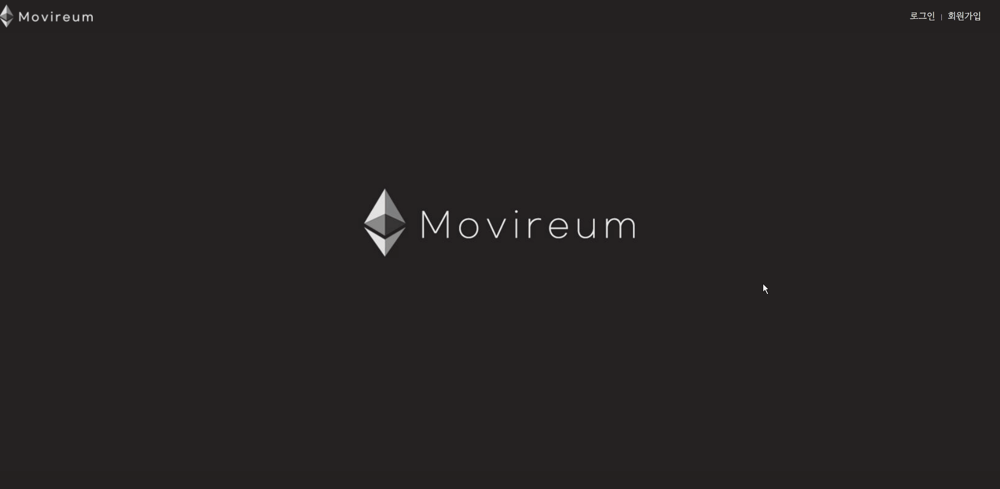
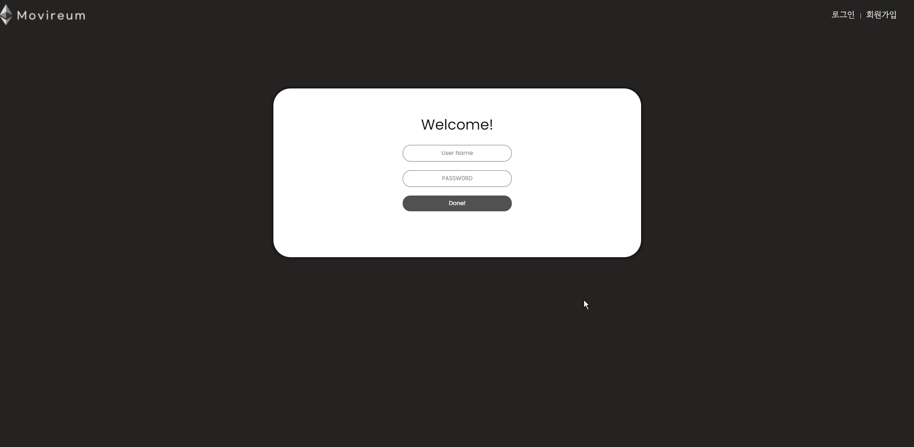
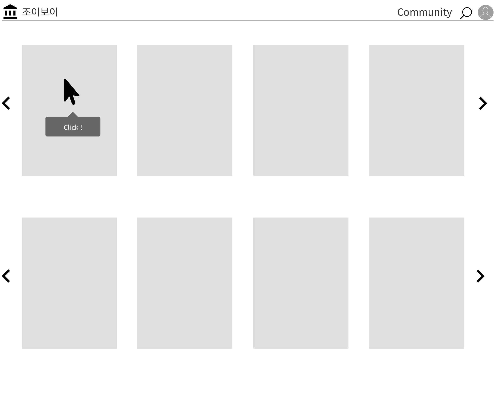
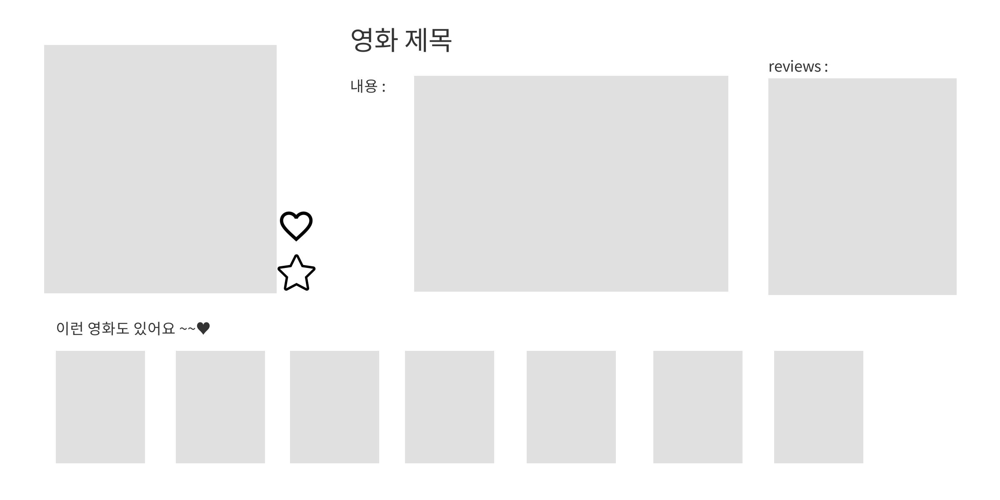
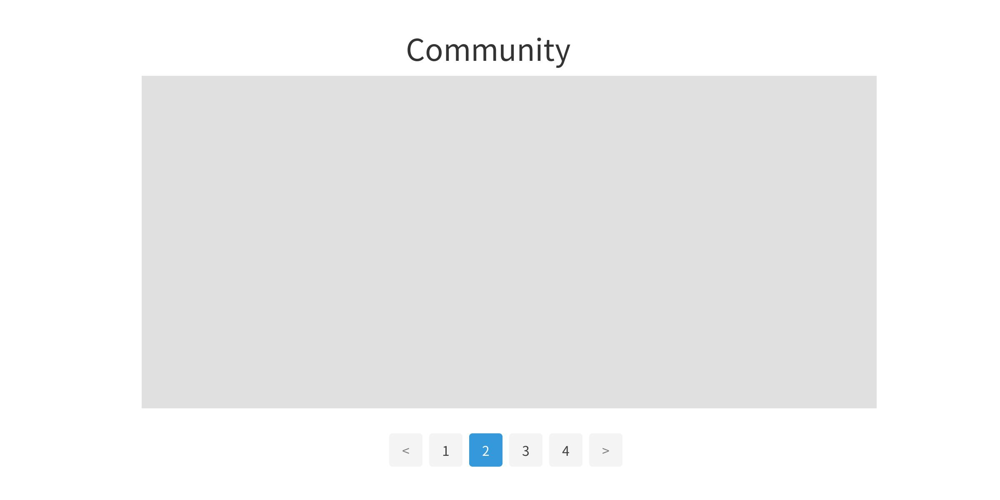
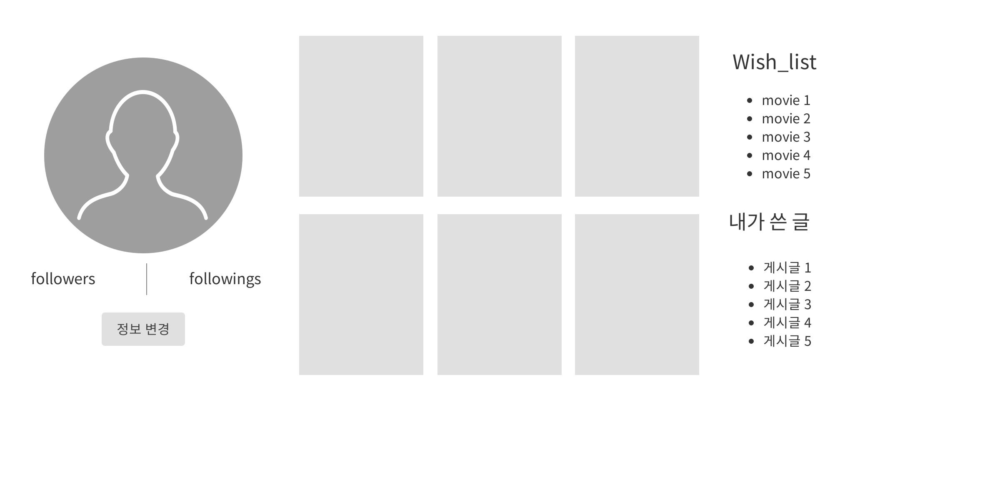
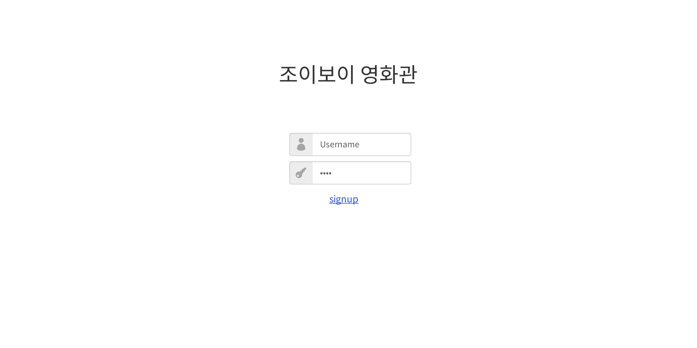

# 🎉Final Project 🎉

# 	"Movireum"


> MOVIEREUM : 스페인어에서 유래된  "영화관" 이란 뜻의 단어이다.
>
> Django REST API와 Vue.js를 활용한 영화 추천 및 커뮤니티 사이트
>
> 팀장: 이상엽 
>
> 팀원: 조성현
>
> 개발기간
>
> - 2021.11.17 ~ 2021.11.25 (9 days)


# ◾  기본 기능  Preview

- ### Index 페이지 & 로그인 

  

  > 페이지의 기본 구성과 데이터 갱신을 위해 1초 가량의 Cover Page를 사용하여 로그인으로 넘겨 주었다.


- ### Login  → Home 페이지

  

  

- ### Home Page 구성

  

  > Carousel을 이용하여 영화 포스터 나열 (클릭시 Detail 페이지로 이동)
  >
  > 19개의 Genre를 7개의 Category로 병합하여 장르별 영화 목록


- ### 영화 상세 페이지

  

  > 영화 클릭시 Detail 이동
  >
  > 예고편 재생 기능 , 좋아요 / Watched 버튼을 통해 좋아하는 영화와 시청한 영화 추가 가능
  >
  > 리뷰(한줄평) 을 평점과 함께 작성할 수 있으며 제목을 클릭 해당 유저의 프로필 페이지 이동
  >
  > 해당 영화의 genre를 조회하여 비슷한 영화 출력
  >
  > 비슷한 영화 목록에 마우스를 hover 하면 그 영화의 제목, 평점, 장르를 보여주는 뒷면을 보여준다.


- ### 검색 기능

  

  > Navbar에 있는 검색아이콘 클릭시 검색 창이 나오고 검색된 영화의 이미지와 제목을 출력하고 클릭시 Detail 페이지로 이동


- ### 커뮤니티 & 프로필

  

  > 게시판 기능 
  >
  > 게시판에 Daily , QnA, Recommend, Review 로 분류하여 해당 카테고리의 게시글만 볼 수 있다.
  >
  > 게시글 작성시 해당 카테고리를 제목의 기본값으로 제공한다.
  >
  > 게시글의 제목을 클릭시 게시글 작성자의 프로필로 이동
  >
  > 프로필은 해당 유저의 팔로우 / 팔로워 수, 좋아요한 영화의 목록, 시청한 영화의 목록을 타임라인 형식으로 보여준다.


- ### 영화 추천

  

  > 1. 좋아요 기반 영화  추천
  >
  >    유저가 좋아요를 누른 영화들의 장르들을 취합하여 해당 최빈 장르의 영화를 인기도를 기준으로 정렬하여 50개를 추출해 10개씩 추천해준다.
  >
  >    옆의 아이콘을 클릭시 새로운 영화를 추천해준다
  >
  > 2. 명작 추천
  >
  >    영화 데이터안에서 인기도와 평점으로 정렬 후 다시하번 최신 개봉순으로 정렬하여 50개의 데이터를 추출하여 10개씩 추천

#  ◾ 목표 서비스

> 프로젝트 생성 전 페이지 구상도

- ### HOME



> 영화 포스터 클릭하여 Detail 이동


> 검색 기능


> 프로필 페이지 이동


- ### DETAIL



> 영화 상세 정보와 각 영화에 대한 리뷰, 해당 영화와 비슷한 영화 추천 기능

- ### Community



> 게시글 CRUD 기능

- ### Profile


> 다른 사람 프로필에서 팔로우 기능 구현



> 본인 프로필 페이지

- ### Accounts



> 회원가입, 로그인, 로그아웃 기능 구현


#  ◾ ERD(Entity Relationship Model) : 개체-관계 모델


#  ◾ 주요 코드

> ## Back

- ### Movies

  - /views.py

```python
@api_view(['GET'])
def get_genres_db(request):
    if Genre.objects.exists():
        pass
    else:
        url = f'https://api.themoviedb.org/3/genre/movie/list?api_key={API_KEY}&region=KR&language=ko'
        req = requests.get(url).json()
        Genre.objects.bulk_create(
            [Genre(
                tmdb_genre_id = data.get('id'),
                name = data.get('name'),
                ) for data in req.get('genres')]
        )
        return Response({ 'db': '장르 생성' })
    return Response({'db': '이미 Genre 데이터 있음'})

@api_view(['GET'])
def get_popular_movies_db(request):
    popular_movies = []
    for page in range(1,61):
        url = f'https://api.themoviedb.org/3/movie/popular?api_key={API_KEY}&page={page}&region=KR&language=ko'
        datas = requests.get(url).json()
        for data in datas.get('results'):
            if Movie.objects.filter(title=data.get('title')).exists():
                movie =  Movie.objects.get(title=data.get('title'))
                movie.popularity = data.get('popularity')
                movie.vote_count = data.get('vote_count')
                movie.vote_average = data.get('vote_average')
                movie.save()
            else:
                movie = Movie.objects.create(
                    tmdb_id = data.get('id'),
                    title = data.get('title'),
                    poster_path = 'https://image.tmdb.org/t/p/w500' + data.get('poster_path'),
                    overview = data.get('overview'),
                    vote_count = data.get('vote_count'),
                    vote_average = data.get('vote_average'),
                    release_date = data.get('release_date'),
                    popularity = data.get('popularity'),
                )
                for genre_id in data.get('genre_ids'):
                    genre = Genre.objects.get(tmdb_genre_id=genre_id)
                    genre.movies.add(movie)

            popular_movies.append(movie)
    movies = popular_movies[:15]
    serializer = MovieSerializer(movies, many=True)
    return Response(serializer.data)

@api_view(['GET'])
def get_now_playing_movies_db(request):
    now_playings = []
    url = f'https://api.themoviedb.org/3/movie/now_playing?api_key={API_KEY}&region=KR&language=ko'
    datas = requests.get(url).json()

    for data in datas.get('results'):
        if Movie.objects.filter(title=data.get('title')).exists():
            movie =  Movie.objects.get(title=data.get('title'))
            movie.popularity = data.get('popularity')
            movie.vote_count = data.get('vote_count')
            movie.vote_average = data.get('vote_average')
            movie.save()
        else:
            movie = Movie.objects.create(
                tmdb_id = data.get('id'),
                title = data.get('title'),
                poster_path = 'https://image.tmdb.org/t/p/w500' + data.get('poster_path'),
                overview = data.get('overview'),
                vote_count = data.get('vote_count'),
                vote_average = data.get('vote_average'),
                release_date = data.get('release_date'),
                popularity = data.get('popularity'),
            )
            for genre_id in data.get('genre_ids'):
                genre = Genre.objects.get(tmdb_genre_id=genre_id)
                genre.movies.add(movie)
        now_playings.append(movie)
    serializer = MovieSerializer(now_playings, many=True)
    return Response(serializer.data)
```

###### 이번 프로젝트에서 가장 중요한 역할을 하는 코드. 장르 데이터와 인기 영화와 현재 상영작 데이터를 TMDB API 요청을 통해 받아온 후 DB에 있는 데이터라면 최신화 시켜주고 아닌 경우 새로 생성하였다. 특히 인기 영화 데이터를 받아올 때 한번에 많은 양의 데이터를 요청해서 받아온다.

```python
@api_view(['GET'])
def get_similar_movies(request, movie_pk):
    similar_movies_list = []
    movie = Movie.objects.get(pk=movie_pk)
    genre = movie.genres.all()[0]
    print(genre)
    similar_movies = genre.movies.all()
    for i in range(5):
        idx = random.randint(0,len(similar_movies)-1)
        similar_movies_list.append(similar_movies[idx])
    serializer = MovieSerializer(similar_movies_list, many=True)
    return Response(serializer.data)
```

###### 비슷한 영화는 해당 영화의 첫 번째 장르와 같은 장르의 영화를 불러온 후 5개를 랜덤으로 뽑아 데이터를 전송한다.

```python
@api_view(['GET', 'POST'])
def likes(request, movie_pk):
    # if request.user.is_authenticated:
    movie  = get_object_or_404(Movie, pk= movie_pk)
    if request.method == 'GET':
        if movie.like_users.filter(pk = request.user.pk).exists():
            liked = False
        else:
            liked = True
        context = {
            'liked': liked,
        }
        return JsonResponse(context)
    else:
        if movie.like_users.filter(pk = request.user.pk).exists():
            movie.like_users.remove(request.user)
            liked = False
        else:
            movie.like_users.add(request.user)
            liked = True
        context = {
            'movieId': movie.id,
            'liked': liked,
        }
        return JsonResponse(context)

@api_view(['GET', 'POST'])
def watch(request, movie_pk):
    # if request.user.is_authenticated:
    movie  = get_object_or_404(Movie, pk= movie_pk)
    if request.method == 'GET':
        if movie.wish_users.filter(pk = request.user.pk).exists():
            wished = False
        else:
            wished = True
        context = {
            'wished': wished,
        }
        return JsonResponse(context)
    else:
        if movie.wish_users.filter(pk = request.user.pk).exists():
            movie.wish_users.remove(request.user)
            wished = False
        else:
            movie.wish_users.add(request.user)
            wished = True
        context = {
            'movieId': movie.id,
            'wished': wished,
        }
        return JsonResponse(context)
```

###### 각 유저가 좋아하는 영화와 시청한 영화를 조회, 추가, 삭제하고 그 데이터를 전송한다.

```python
@api_view(['GET'])
def get_genre_movies(request, category):
    movies = Movie.objects.all()
    genre_movies = set()
    for movie in movies:
        for genre in movie.genres.all():
            if category ==1 : # 액션 모험 sf
                if genre.id == 1 or genre.id == 2 or genre.id == 15:
                    genre_movies.add(movie)

            elif category == 2: # 가족 코미디
                if genre.id == 8 or genre.id == 4:
                    genre_movies.add(movie)

            elif category == 3: # 드라마 로맨스
                if genre.id == 7 or genre.id == 14:
                    genre_movies.add(movie)

            elif category == 4: # 범죄 스릴러
                if genre.id == 5 or genre.id == 17:
                    genre_movies.add(movie)

            elif category == 5: # 공포 미스터리
                if genre.id == 11 or genre.id == 13:
                    genre_movies.add(movie)

            elif category == 6: # 역사 전쟁
                if genre.id == 10 or genre.id == 18 or genre.id == 19:
                    genre_movies.add(movie)

            else:
                if genre.id == 3:
                    genre_movies.add(movie)

        if len(genre_movies) == 20:
            break
    genre_movies = list(genre_movies)[:20]
    serializer = MovieSerializer(genre_movies, many=True)
    return Response(serializer.data)
```

###### 우리가 정한 영화 장르 카테고리를 만들어서 각 카테고리별로 영화들을 모아 20개의 영화 데이터를 전송한다.

```python
@api_view(['GET'])
def recommended_by_like(request):
    user = request.user
    like_movies = user.like_movies.all()
    like_movies_id = []
    for like_movie in like_movies:
        like_movies_id.append(like_movie.id)
    tmp_movie_ids = []
    # 좋아하는 영화가 있는 경우
    if len(like_movies) >= 1:
        for like_movie in like_movies:
            movie = Movie.objects.get(pk=like_movie.id)
            genre = movie.genres.all()[0]
            # 비슷한 장르의 영화 중 populartiy 내림차순 정렬 후 좋아요 누른 영화 당 가장 높은 popularity를 가진 영화 20개 추가
            similar_movies = genre.movies.all().order_by('-popularity')
            cnt = 0
            for similar_movie in similar_movies:
                # 만약 이미 좋아요를 누른 영화거나 담아놓은 영화라면 pass
                if similar_movie.id in like_movies_id or similar_movie.id in tmp_movie_ids:
                    pass
                else:
                    tmp_movie_ids.append(similar_movie.id)
                    cnt += 1
                if cnt == 20:
                    break
        recommended_movies = []
        for movie_id in tmp_movie_ids:
            movie = Movie.objects.get(pk=movie_id)
            recommended_movies.append(movie)
        # 좋아하는 영화 수 X 20 개의 영화 데이터 중 10를 랜덤 뽑기 후 전송
        serializer = MovieSerializer(random.sample(recommended_movies, 10), many=True)
        return Response(serializer.data)
    else:
        # 좋아하는 영화가 없는 경우
        for i in range(5):
            # 임의로 5개의 영화를 가져온 후
            random_id = random.randint(1, len(Movie.objects.all()))
            movie = Movie.objects.get(pk = random_id)
            genre = movie.genres.all()[0]
            # 위와 같은 방식으로 임의의 영화 장르와 비슷한 영화 목록 20개씩을 받아온 후
            similar_movies = genre.movies.all().order_by('-popularity')
            cnt = 0
            for similar_movie in similar_movies:
                if similar_movie.id in tmp_movie_ids:
                    pass
                else:
                    tmp_movie_ids.append(similar_movie.id)
                    cnt += 1
                if cnt == 20:
                    break
        recommended_movies = []
        for movie_id in tmp_movie_ids:
            movie = Movie.objects.get(pk=movie_id)
            recommended_movies.append(movie)
        # 총 100개의 영화 정보 중 10개 랜덤 뽑기 후 전송
        serializer = MovieSerializer(random.sample(recommended_movies, 10), many=True)
        return Response(serializer.data)

@api_view(['GET'])
def recommended_by_rate(request):
    movies = Movie.objects.all().order_by('-vote_average', '-release_date')
    reco_movies = []
    for movie in movies:
        reco_movies.append(movie)
        if len(reco_movies) == 50:
            break
    serializer = MovieSerializer(random.sample(reco_movies, 10), many=True)
    return Response(serializer.data)
```

###### 추천 페이지에서 사용할 추천 알고리즘 코드. 유저가 좋아하는 영화 데이터 중에서 비슷한 장르의 영화 중 popularity 내림차순 정렬 후 좋아요 누른 영화 당 가장 높은 popularity를 가진 영화 20개를 추가한다. 만약 좋아요를 누른 영화이거나 이미 저장한 데이터라면 패스. 이런 방식으로 좋아요를 누른 영화당 20개의 영화 데이터를 모은 후 그중 10개의 데이터를 랜덤으로 뽑아 데이터를 전송한다.

###### 두 번째 알고리즘은 DB에 있는 영화 데이터를 평점으로 내림차순 정렬 후 다시 개봉일을 기준으로 정렬하고 그중 50개를 뽑는다. 그후 다시 10개의 영화를 랜덤으로 뽑아 데이터를 전송한다.


- ### Community

  - /views.py

```python
@api_view(['GET', 'POST'])
def article_list(request):
    if request.method=='GET':
        # articles = get_list_or_404(Article)
        articles = Article.objects.all().order_by('-pk')
        serializer = ArticleSerializer(articles, many=True)
        data = serializer.data
        return Response(data)
    else:
        serializer = ArticleSerializer(data = request.data)
        if serializer.is_valid(raise_exception=True):
            serializer.save(user=request.user)
            return Response(serializer.data, status=status.HTTP_201_CREATED)
        return Response({ 'article': '생성되지 않았습니다.' })

@api_view(['GET', 'PUT', 'DELETE'])
def article_detail(request, article_pk):
    article = get_object_or_404(Article, pk=article_pk)
    if request.method == 'GET':
        serializer = ArticleSerializer(article)
        return Response(serializer.data)
    elif request.user == article.user:
        if request.method == 'PUT':
            serializer = ArticleSerializer(article, data=request.data)
            if serializer.is_valid(raise_exception=True):
                serializer.save()
                return Response(serializer.data)
        elif request.method == 'DELETE':
            article.delete()
            data = {
                'delete': f'{article_pk}번 게시글이 삭제되었습니다.'
            }
            return Response(data, status=status.HTTP_204_NO_CONTENT)
    return Response({ 'Unauthorized': '권한이 없어요.' }, status=status.HTTP_401_UNAUTHORIZED)

@api_view(['GET', 'POST'])
def comment_list(request, article_pk):
    article = get_object_or_404(Article, pk=article_pk)
    if request.method=='GET':
        # articles = get_list_or_404(Article)
        comments = Comment.objects.filter(article_id= article_pk)
        serializer = CommentSerializer(comments, many=True)
        data = serializer.data
        return Response(data)
    else:
        serializer = CommentSerializer(data = request.data)
        if serializer.is_valid(raise_exception=True):
            serializer.save(user=request.user, article=article)
            return Response(serializer.data, status=status.HTTP_201_CREATED)
        return Response({ 'article': '생성되지 않았습니다.' })

@api_view(['GET', 'PUT', 'DELETE'])
def comment_detail(request, comment_pk):
    comment = get_object_or_404(Comment, pk=comment_pk)
    if request.method == 'GET':
        serializer = CommentSerializer(comment)
        return Response(serializer.data)
    elif request.user == comment.user:
        if request.method == 'PUT':
            serializer = CommentSerializer(comment, data=request.data)
            if serializer.is_valid(raise_exception=True):
                serializer.save()
                return Response(serializer.data)
        elif request.method == 'DELETE':
            comment.delete()
            data = {
                'delete': f'{comment_pk}번 리뷰가 삭제되었습니다.'
            }
            return Response(data, status=status.HTTP_204_NO_CONTENT)
    return Response({ 'Unauthorized': '권한이 없어요.' }, status=status.HTTP_401_UNAUTHORIZED)
```

###### 게시글 CRUD와 각 게시글에 대한 댓글 CRUD를 구현


- ### accounts

  - /views.py

```python
@api_view(['POST'])
def follow(request, username):
    person = get_object_or_404(get_user_model(), username=username)

    if request.user != person:
        if request.user in person.followings.all():
            followed = False
            person.followings.remove(request.user)
        else:
            followed = True
            person.followings.add(request.user)
        
        context = {
            'followed': followed,
            'person': person.username,
        }
        return JsonResponse(context)
    return Response({ 'user': '본인입니다.' })
```

###### 팔로우 기능 구현. 팔로우는 항상 팔로잉과 팔로워가 헷갈리는 것 같다.

```python
@api_view(['GET'])
def get_like_movies(request, username):
    like_movies_list = []
    person = get_object_or_404(get_user_model(), username=username)
    like_movies = person.like_movies.all()
    for like_movie in like_movies:
        like_movies_list.append(like_movie.id)
    serializers = {
        'like_movies_list' : like_movies_list
    }
    return Response(serializers)

@api_view(['GET'])
def get_watch_movies(request, username):
    wish_movies_list = []
    person = get_object_or_404(get_user_model(), username=username)
    wish_movies = person.wish_movies.all()
    for wish_movie in wish_movies:
        wish_movies_list.append(wish_movie.id)
    serializers = {
        'wish_movies_list': wish_movies_list
    }
    return Response(serializers)
```

###### 해당 유저가 좋아하는 영화와 시청한 영화 목록을 보내준다.


> ## Front

#### 가장 힘들었거나 새로운 부분

##### 1. carousel

```vue
<template>
  <div>
    <h1>액션 · 모험 · SF</h1>
    <carousel :loop="true" :mouseDrag="false" :perPage="5">
      <slide v-for="movie in movies" :key="movie.id" style="width:550px; height:820px;">
        
      </slide>
    </carousel>
  </div>
</template>
```

###### 많은 영화 포스터들을 보여주기위해 carousel을 적용하였다. 이를 위해 라이브러리를 설치하여 적용시켰다..

##### 2. b-table

```vue
<div class="container mt-3">
	<b-table :items="reviews" :fields="fields" style="color: white;">
		<template #cell(user)="data">
			<b-icon v-if="data.value === username" icon="trash-fill" class="me-4" @click="deleteReview(data.item.id)"></b-icon>
		<router-link :to="{ name: 'Profile', params:{ username: data.value }}" class="text-decoration-none text-reset">{{ data.value }}</router-link>
		</template>
	</b-table>
	<br>
</div>
```

##### 3. 검색 기능

```vue
<template>
  <div v-if="toggleStatus" class="container text-center mb-4">
    <input id="searchinput" type="text" class="form-control" @input="onInputChange" placeholder="영화 검색">
    <carousel
      :perPage="4"
      :navigationEnabled="true"
      :paginationEnabled="false"
    >
      <slide v-for="movie in resultQuery" :key="movie.id">
        <div>
          <p>{{ movie.title }}</p>
          
        </div>
      </slide>
    </carousel>
  </div>
  
</template>
	...
    resultQuery(){
      if (this.searchQuery){
        return this.allMovies.filter((item)=> {
          return this.searchQuery.toLowerCase().split(' ').every(v=> item.title.toLowerCase().includes(v))
        })
      } else{
        return [];
      }
    }
  }
}
</script>
```

##### 4. 수정 및 삭제

###### 수정과 삭제를 할 때 데이터를 조회하는 methods가 부모 컴포넌트에 있고 수정과 삭제 methods가 자식 컴포넌트에 있을 때 수정 및 삭제 후  상태를 적용시키기 위해 갱신하는 방법을 찾다 처음에는 페이지 자체를 새로고침하였지만, emit 이벤트를 통해 해결할 수 있었다.

##### 5. Layout과 Grid System

###### vueBootstrap을 새로 적용하고 CSS를 오랜만에 하다보니 배치나 정렬에 헷갈리는 부분이 많았고, 프로젝트가 진행될수록 깊이가 깊어져 어려움이 많아 공식문서를 참고하며 수정을 하였다.


# ◾ 마무리하며 ... 🤞

> ## 이상엽
>
> ### 	1. 1학기의 내용을 전부 복습하는 과정
>
> - 처음 프로젝트를 시작할 땐 1학기의 전 과정에 대한 정리가 부족한 느낌이었는데 프로젝트를 진행하면 할수록 1학기의 내용이 전부 다 필요한 과정들이었음을 몸소 느낄 수 있었다. 그러면서 지난 교재들도 다시 열어보면서 1학기 과정을 다시 한 번 복습해보는 느낌의 프로젝트였다.
>
> ### 2. 설계의 중요성
>
> - 프로젝트를 시작하기 전에도 관통 프로젝트 라이브 강의나 교수님께서도 프로젝트 시작 전 설계의 중요성을 강조하셨는데 이번 프로젝트를 하면서 더 느끼게 되었다. 하루 정도의 시간을 설계에만 쏟았음에도 불구하고, 프로젝트 과정에서 세부적으로는 많은 수정이 있었다.
> - 그래도 처음 설계를 잘 해서 최종 완성본이 처음 설계와 유사하게 완성이 된 것 같다.
>
> ### 3. 백지장도 맞들면 낫다.
>
> - 우리는 CSS 부분을 제외하고 거의 모든 부분을 역할을 따로 나누지 않고 같이 고민하면서 프로젝트를 진행하였다. 초반에는 다른 팀들에 비해 진도가 많이 느린 것 같다는 느낌을 받았지만, 프로젝트가 진행될수록 결코 다른 팀보다 느리지 않다는 것을 느꼈다. 같이 고민하면서 에러가 발생했을 때 혼자보다 훨씬 빠르고 쉽게 찾아낼 수 있었던 것이 원인이라고 생각한다.
>
> ### 4. 에러와의 싸움
>
> - 프로젝트에서 가장 기억에 남는 것은 프로젝트 기간동안 수없이 봤던 에러창인 것 같다. 실제 코드를 작성하는 것보다 에러창을 보며 원인을 찾는 과정이 더 오래 걸린 것 같다. 그럴 때마다 페어와 함께 콘솔 창을 찍어보며 열심히 에러를 찾아가며 프로젝트를 진행했다.
>
> ### 5. 하면 된다.
>
> - 프로젝트를 시작하면서 구현할 기능들을 얘기하면서 이런 게 가능할까?라는 생각이 엄청 많이 들었다. 그래도 공식문서나 구글링을 통해 하나씩 찾아가면서 우리가 하고자 하는 것을 찾아냈고 많은 부분을 구현할 수 있었다. 이런 부분에서 페어인 성현님이 많은 아이디어를 냈고 프로젝트 구성이나 레이아웃에 많은 역할을 해주었다. 처음 시작할 땐 막막하기만 하던 프로젝트가 어느새 끝이 났고 걱정만 가득했던 부분들을 페어와 함께 스스로 해결하면서 하면 된다라는 것을 다시 한 번 느낄 수 있었던 프로젝트였다.


> ## 조성현
>
> ### 1. 생애 첫 프로젝트 !
>
> - 개발자가 되고 싶다는 생각을 한 후 SSAFY에 입학하여 약 5개월 동안 개발을 배우고 진행한 첫 프로젝트!
> - 프로젝트 시작하기 전 첫 프로젝트라는 이유로 설렘 반 과연 내가 한 학기동안 배운 것을 잘 활용하여 내가 생각하고 계획한 구조와 모양, 기능을 잘 구현할 수 있을까라는 걱정 반으로 프로젝트를 시작하였다. 처음 3일은 막막함을 느꼈다. 그 동안 배웠던 내용이 완전히 내것이 된 상태가 아니라 원하는 모양과 구조를 만들 수 없었고, 무엇보다 모델설정과 기능 간의 상호 연동을 초기에 완벽하게 정해놓고 시작해야한다고 생각하여 모델 구성과 구상도를 설정하는데 많은 시간을 쓰고 있었는데, 반 학우들은 이미 프로젝트를 생성하고 코딩을 하는 모습을 보고 기간내에 완성을 할 수 있을까라는 생각과 생각보다 복잡한 모델관계에 벽을 느꼈다. 하지만 시간이 지나면서 어렵게만 느껴졌던 모델관계과 어느새 당연하게 머리속에서 이어지는느낌이였다. 그런 구조를 짜는데 많은 시간을 투자해서인지 코드는 비교적 수월하게 진행 할 수 있었던 것 같다.
>
> ### 2. 페어의 중요성
>
> - 평소 알고리즘 스터디를 같이 진행하여 편한 사이였던 상엽이에게 프로젝트를 같이 진행하자고 제안했다 .
> - 성실한 페어를 만나 9일이란 시간동안 온전히 프로젝트에 전념 할 수 있었다. 편한 사이였기에 서로의 의견을 말하거나 회의를 진행할 때 서로의 의견을 마음껏 말하고 조정 할 수 있었고 대립되는 의견이 있을 때도 갈등없이 배려와 솔직함을 적절하게 섞어 이야기 할 수 있었다 .
> - 나는 비교적 중요도가 떨어지는 기능적 오류나 모순에 넘어가지 못하고 완벽하게 해결하고 넘어가야하는 성격을 가졌고 처음하는 일주일동안 진행하는 프로젝트라 시간 분배에 문제가 있었지만 팀장이 그럴때마다 딴길로 새는 나를 방향을 잡아주어서 기간내에 완성할 수 있었다.
>
> ### 3. 공식문서와 라이브러리 사용법
>
> - 한 학기라는 시간 동안 정말 온 힘을 다해 공부했지만 정규 수업에서 배운 내용을 복습하기에도 바빠 공식문서를 100% 활용할 시간이 없었다 .
> - 이번 프로젝트를 진행하면서 초기에 '이 기능을 구현할 수 있을까?,  '이런 표현이 가능한가?' 등등 혼자고민하며 시간을 보낸 경우가 많았는데 처음에는 읽기 쉬운 블로그나 교재를 참고했다. 많은 오류와 검색 실패에 해결책은 항상 공식문서 였다. 내가 생각하는 대부분의 기능과 표현 그리고 그 사용법은 내가 생각했던 것보다 훨씬 자세하고 쉽게 기술되어 있었다.
> - 수업시간에서 배운 라이브러리 이외의 라이브러리를 사용할 기회가 적었고 어느샌가 교재를 보고 라이브러리를 설치하고 import 해오고 있었다. 
>   이번 프로젝트를 하면서 느낀 점은 라이브러리의 사용은 대게 같은 흐름으로 사용할 수 있었고 그것에 대한 설명 역시 여러번 읽어보니 어려울게 없었던 것들이였다.
> - ❕ 이번 프로젝트에서 가장 많이 느낀점과 얻은 것을 뽑으라면 공식문서와 라이브러리 사용법의 중요성을 뽑을 것이다.
>
> ### 4. 에러와 친숙해진 나 
>
> -  살면서 본 빨간 글씨보다 이번 9일동안 본 빨간글씨가 너 많은 느낌이다.
> - 5일 차 쯤되니 에러번호만 봐도 '여기쯤에서 오류가 발생했나보다' 하고 먼저보게되는 코드들이 있었다. 페어와 함께 console.log를 엄청나게 찍어대며 데이터구조를 보는법도 더 정확하게 알게 된거 같다.
>
> ### 5. 성취감과 아쉬움
>
> - 정말 시간 내에 제대로 된 화면도 기능도 만들지 못 할 거 같은 8일이란 시간이 지나고 9일째가 되던 날 보니 프로젝트 전 구상했던 설계도의 기능을 모두 채우고 꾸미기까지한 결과물이 나와있었다.
> - 정말 처음부터 끝까지 누구의 도움도 없이 페어와 단둘이서 모든 과정에 참여하여 나만의 웹페이지를 만든 것에 너무 뿌듯하고 9일 동안 잠과 식사를 제외하면 컴퓨터 앞에만 앉아있었고 하루에 5시간씩 자면서 의자에만 앉아있어 몸이 엄청 피곤한데도 지루하지않고 정말 시간가는 줄 모르고 지냈던 즐거운 시간들이였다. 아직 부족한게 많지만 프로그래밍이 재밌고 긴 시간에도 지치지않은걸 보니 어쩌면 개발자 체질일지도 ??
> - 성취감만 있는 것은 아니다. 제출 날짜가 다가올수록 그리고 나의 프로젝트에 이해도가 높아질수록 '아 이 기능도 넣고 싶은데...', '아 이런 모델을 더 추가했으면 더 많은 기능을 추가 구현 했을 텐데...' 등 더 좋은 페이지를 만들 수 있었던 것에대한 아쉬움이 많은 프로젝트였다.
> - 하지만 제출기간은 끝났어도 내 페어도 내 프로젝트도 남아있다 . 더 발전 시켜서 아쉬움을 덜어낼 것이다 !!!!  
>
> 
